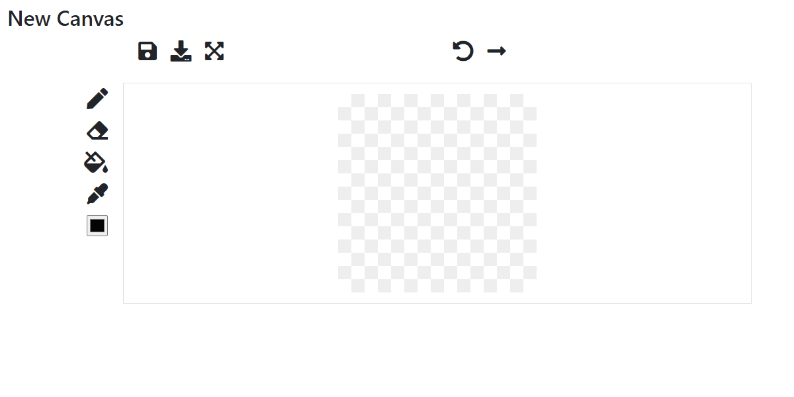

# Pixel Art Editor Demo

This is my demo application built with Python and TypeScript.  
You can edit, save, download your pixel arts with it.



## How to start locally

``` bash
cd ./backend/
python -m venv venv
./venv/Scripts/activate
pip install -r requirements.txt
python manage.py makemigrations
python manage.py migrate
python manage.py runserver
```

**Note:**  
The security e-mails are displayed in your console on the local environment.
